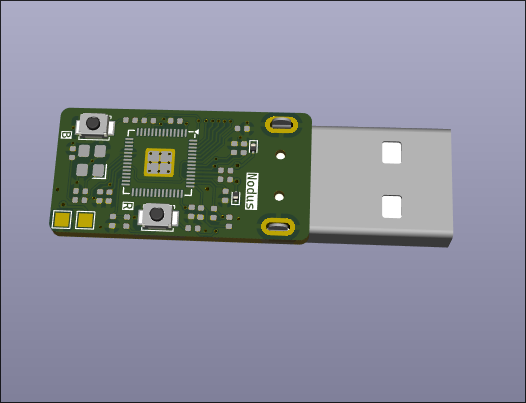
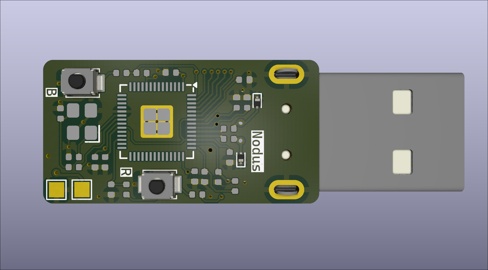
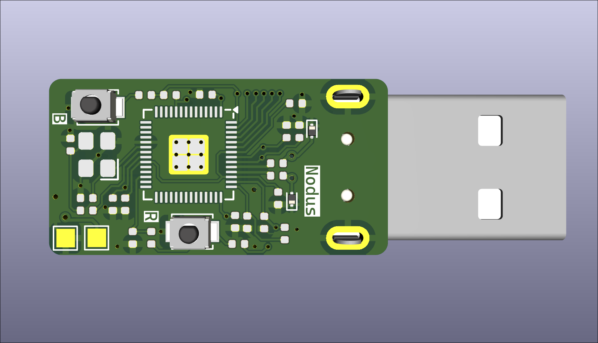
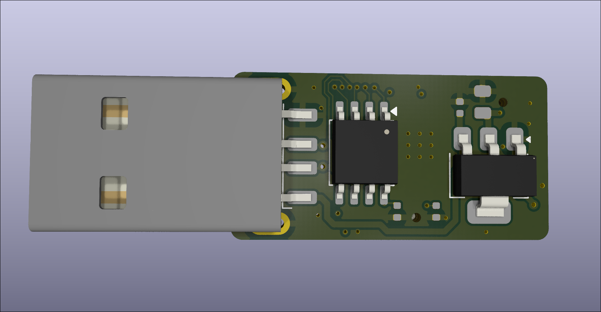

# Nodus — RP2040 Custom USB Keystroke Injection Platform


**Nodus** is a custom, ultra-compact USB Human Interface Device (HID) platform designed for keystroke injection, automated penetration testing, and security research. Powered by the Raspberry Pi RP2040 microcontroller, the board features dedicated high-speed QSPI flash memory, a precision external crystal oscillator for reliable USB PHY timing, and hardware physical controls for rapid reset and bootloader recovery.

---

## 📷 Board Hardware Overview

The PCB is custom designed in a standard USB stick form factor with an integrated PCB USB-A plug:

<p align="center">
  
  
</p>

<p align="center">
  
  
</p>

### Key Hardware Features

* **Microcontroller:** Raspberry Pi RP2040 Dual-Core ARM Cortex-M0+ running up to 133 MHz.
* **Storage:** High-speed QSPI NOR Flash IC for payload scripts and custom firmware storage.
* **Clock Source:** External 12 MHz Crystal Oscillator ensuring strict USB 2.0 full-speed timing stability.
* **On-Board Controls:**
  * **`B` (BOOTSEL):** Physical tactile button to force UF2 bootloader mode upon startup.
  * **`R` (RESET):** Hardware reset button for fast rebooting and rapid payload re-execution cycles without unplugging the drive.
* **Form Factor:** Slim, low-profile SMT design tailored for standard custom USB flash drive enclosures.

---

## 📊 Technical Specifications

| Component | Specification / Notes |
| :--- | :--- |
| **Core Processor** | RP2040 (Dual ARM Cortex-M0+, 264KB SRAM) |
| **Clock Source** | 12.000 MHz SMD Crystal Oscillator ($\pm$20 ppm) |
| **Flash Memory** | External QSPI NOR Flash (W25Qxx series or equivalent) |
| **Interface** | USB 2.0 Full-Speed (12 Mbps) Male USB-A Connector |
| **Power Supply** | 5V VBUS regulated via low-dropout (LDO) regulator to 3.3V |
| **Status Indicators** | Configurable User/Status LED(s) |
| **Debug & Control** | Tactical Boot/Reset switches, SWD target pads |

---

## 📁 Repository Structure


```

.
├── Hardware/            # KiCad schematics (.kicad_sch), PCB layouts (.kicad_pcb), and Gerber outputs
├── README.md            # Project overview and instructions
├── rubber_ducky_img1.png
├── rubber_ducky_img2.png
├── rubber_ducky_img3.png
└── rubber_ducky_img4.png

```

---

## 🚀 Quickstart & Hardware Testing

### 1. Putting the Board into Bootloader Mode
1. Plug the Nodus device into a host computer USB port.
2. Hold down the **`B` (BOOTSEL)** button and press the **`R` (RESET)** button once (or plug the device in while holding **`B`**).
3. Release the **`B`** button.
4. The device will enumerate as an external mass storage drive named `RPI-RP2`.

---

## 🛠 Firmware Development (WIP)

> [!NOTE]
> **Work In Progress:** Custom payload engines and dedicated firmware drivers are currently under active development. Hardware architecture and memory configurations are finalized.

Target build process once the C/C++ SDK engine is integrated:

```bash
cd Firmware
mkdir build && cd build
cmake ..
make -j$(nproc)

```

---

> [!WARNING]
> **Security & Usage Disclaimer**
> This hardware platform is intended exclusively for authorized security auditing, educational purposes, penetration testing, and legitimate research activities. Always obtain explicit written permission from system owners before testing or running payloads on any host environment.

---

## 📜 License

This project is licensed under the MIT License. See the `LICENSE` file for details.

```

```
